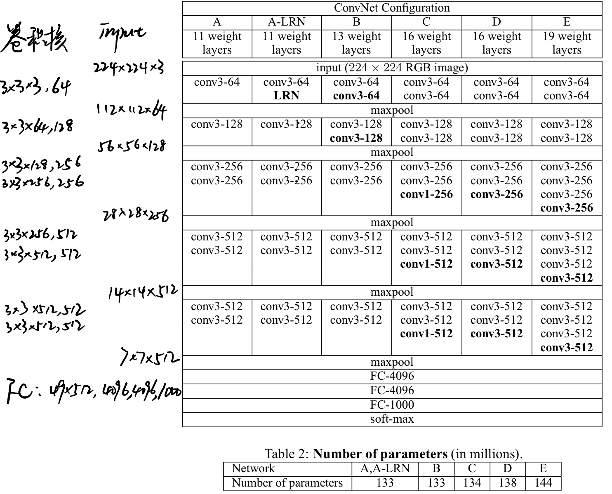
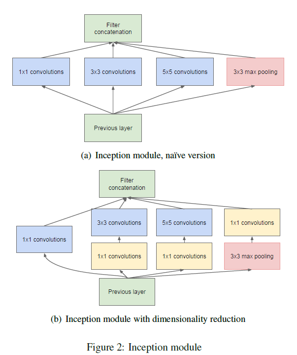
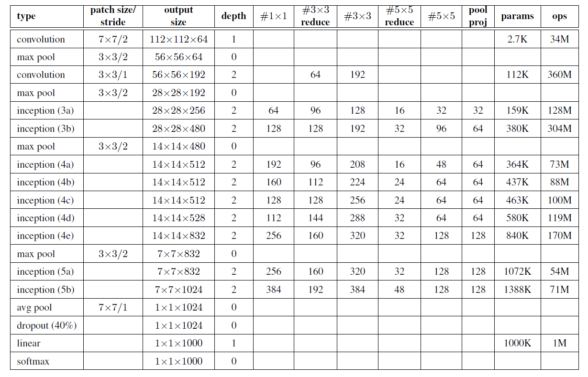
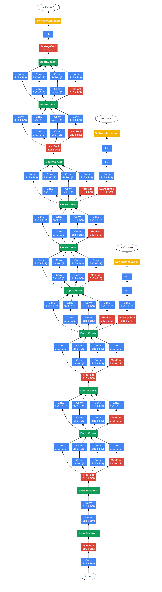
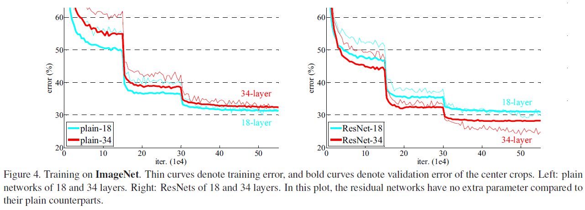
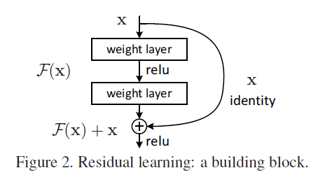
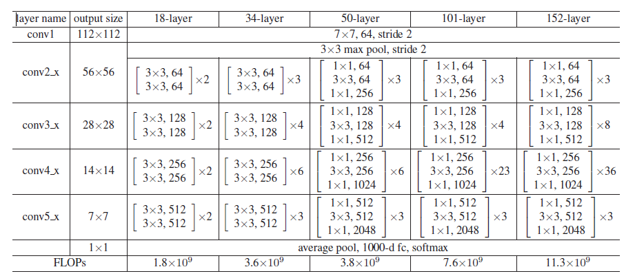

# CNN Series Essays for Image Recognition

## 1. Very Deep Convolutional Networks For Large-Scale Image Recognition(2015 ICLR)

### 简介

论文研究了卷积神经网络卷积层深度对网络在大规模图像识别上准确度的影响，得出使用小卷积核（滤波器）构建深度更大的卷积神经网络能够显著提高大规模图像识别效果。论文提出的这种叫做VGG的深度卷积神经网络模型经过测试，在**ImageNet Large-Scale Visual Recognition Challenge (ILSVRC)**分类任务的**localization tasks（目标定位）**中取得很高准确率，而且这种深度卷积神经网络训练出的深度特征还具有很好的泛化性能。

### 网络结构

- 采用$3\times3$和$1\times1$的小卷积核，卷积层带权输入的外加填充(**padding**)设置为卷积后和填充前维度相同，步长（**strides**）设为1
- 激活函数采用**ReLU(rectification linear unit)**，增加非线性
- 卷积层层数配置为8-16层，后面3层是全连接神经网络作为高层特征的分类器
- （卷积核）滤波器的数量从64开始按照2倍增加，直到512
- 使用小卷积核的叠加达到大卷积核的感知窗口范围（**receptive window size**），而且网络参数较少同时能够增加非线性。例如卷积核通道数为$C$时，$3$个 $3\times3$卷积核叠加可以达到$7\times7$的感知窗口大小，有$3(3^2C^2)=27C^2$个参数，而$7\times7$卷积核参数数量为$7^2C^2=49C^2$。
- 使用$1\times1$卷积核增加非线性（带有一层ReLU激活函数引入非线性）

VGG网络结构：

Parameters count of Model A:
$$
\begin{align*}
133M =& 9\times(3\times64+64\times128+128\times256+256^2+256\times512+3\times512^2)\\
&+(49\times512+1)\times4096+4097\times4096+4097\times1000=132860584
\end{align*}
$$

### Training Image Size

- [**Single-scale Training**] Fixed Smallest Side: $S=256$, $S=384$
- [**Multi-scale Training**] random isotropically-rescale from [256,512]

- **Multi-crop** & **dense evaluation**

## 2. Going Deeper with Convolutions (2015 ICLR, GoogLeNet)

### 简介

GoogLeNet通过Inception Module的设计同时加深了网络深度和宽度，通过Inception Module不同的卷积核大小引入稀疏性，减少过拟合的风险。

### 网络结构

- Inception Module由$1\times1$卷积核，$3\times3$卷积核，$5\times5$卷积核，$3\times3$最大池化构成，不同尺度的卷积核可以同时捕获图像不同尺度的特征

- 不同操作单元的输出串联到一起构成下一层的输入

- 每个卷积层之后都带有ReLU激活，在$3\times3$和$5\times5$卷积之前和最大池化之后加入了$1\times1$卷积核来降维和增加非线性

- 随着层数增加，Inception Module中$3\times3$和$5\times5$卷积核的比例应该更大

- 由于计算资源的限制，只在较高的层数才开始使用Inception Module

  

- 设置了辅助分类器利用网络中间层捕获的特征来分类，克服训练过程中的梯度消失问题。在预测时，辅助分类器将被移除。但是对照实验中表明辅助分类器起的作用不大（0.5%）。

- 训练过程中损失函数为主分类器的代价加上30%的辅助分类器代价。

网络结构参数：

网络结构图：

辅助分类器的结构：

- $5\times5$步长为3的平均池化层
- $1\times1$通道数128的卷积核，用来降维（带有ReLU激活）
- 1024个单元的全连接层，带有ReLU激活
- 70%比例的dropout层
- 带有softmax激活的全连接层作为输出，输出1000个类别的概率

## 3. Deep Residual Learning For Image Recognition (2016 CVPR)

### 简介

本文提出随着卷积神经网络深度越来越大，很多问题开始成为阻碍训练模型的因素。其中梯度消失、梯度爆炸问题可以通过设置正态分布的初始参数和设置归一化的中间层来解决，使得几十层的神经网络可以通过反向传播、随机梯度下降（SGD）来训练到收敛。

但是性能减退的问题依然存在，模型准确度随着层数的累加很快达到饱和，然后快速减退。而且这种性能减退并不是由过拟合造成，很多情况下叠加很多层导致了训练误差升高（这不符合过拟合的特征）。

文章提出了残差块的设计，并在实验中证明使用残差块设计的网络模型更容易优化，而且具有很好的泛化性能。这使得神经网络叠加更多层来提高性能成为可能。

从作者的实验数据来看，堆叠层数增加后训练误差反而降低。

### 网络结构

残差块设计：

把两层叠加的输出设为$F(x)$，残差块输出为$H(x)=F(x)+x$。通过跳转连接的设计让$F(x)$去近似$H(x)-x$。

每个卷积层在激活之前加入**Batch Normalization（BN）**

[Batch Normalization: Accelerating Deep Network Training by Reducing Internal Covariate Shift](https://arxiv.org/abs/1502.03167)

