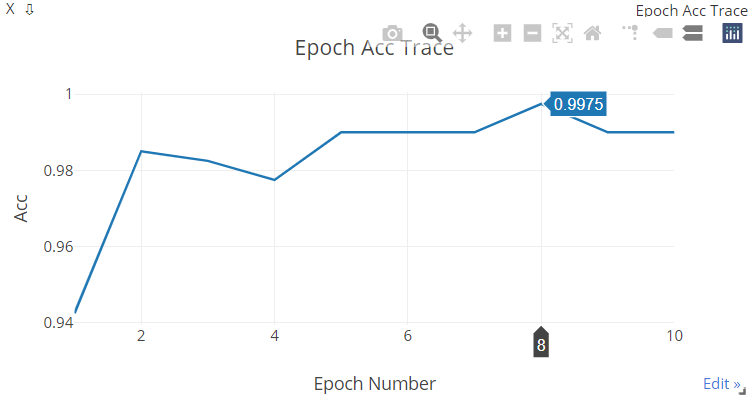
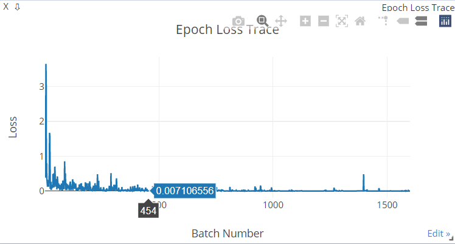
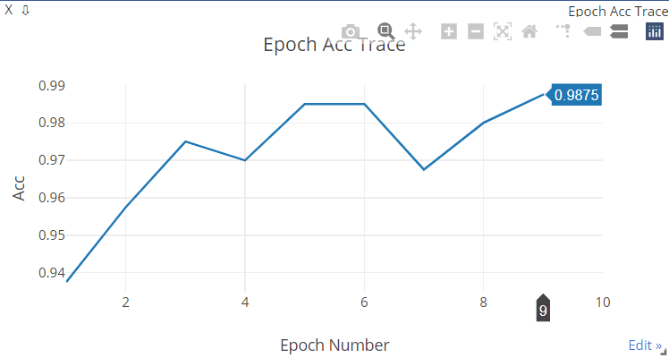
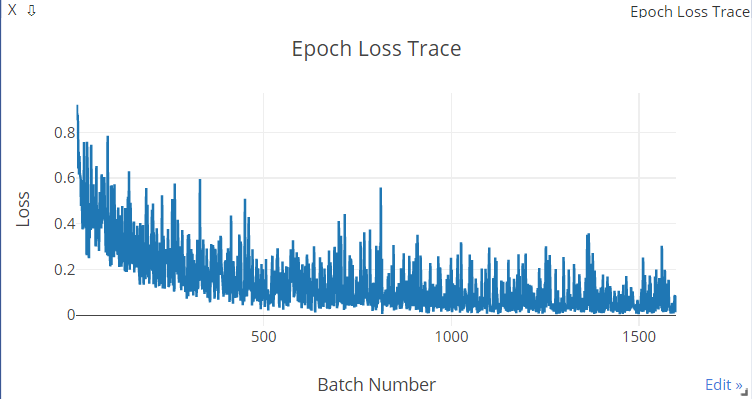
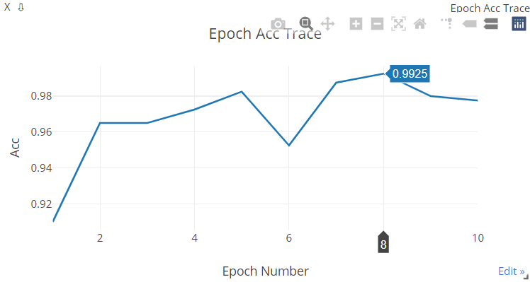
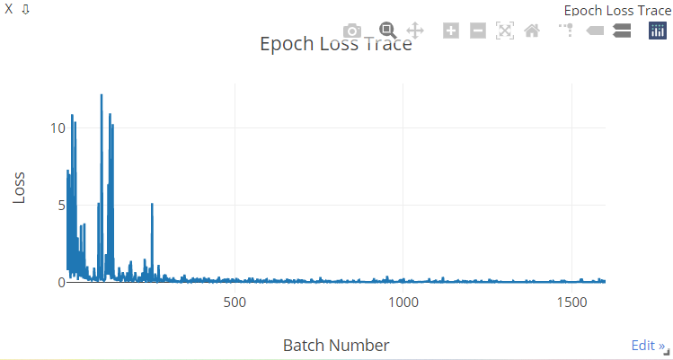

# 基于CNN的海面舰船图像二分类

## 1. 模型依赖的环境和硬件配置

- Python3.8
- Pillow==8.2.0

- torch-1.5.1(cuda9.2)

- torchfile==0.1.0

- torchvision-0.6.1(cuda9.2)

- visdom==0.1.8.9

- GPU: MX150

## 2. 网络结构

### 2.1 VGG9

- 所有卷积层由$3\times3$卷积核构成，每个卷积层后带有ReLU激活
- 在每个卷积层和ReLU池化中间加入Batch Normalization
- $3\times3$卷积核采用步长为1，通过1个像素的加边使得卷积前后特征图维度保持不变
- 卷积层之后的最大池化层采用$2\times2$大小、步长为2、加边大小为0，使得池化后特征图长宽减半

卷积和池化操作的输出特征图维度计算全部采用向下取整：
$$
H_{out}=\left\lfloor\frac{H_{in}+2\times padding-kernel\_size}{stride}+1\right\rfloor\\\notag
W_{out}=\left\lfloor\frac{W_{in}+2\times padding-kernel\_size}{stride}+1\right\rfloor\\
$$

- 使用$2048\times1$的全连接层作为分类器，输出使用Sigmoid激活函数。因为是二分类问题，所以代价函数使用BCELoss（Binary Cross Entropy Loss）。

| 输出维度              | 卷积核/全连接层大小 | Normalization | 激活函数 | 池化层      | 参数数量 |
| --------------------- | ------------------- | ------------- | -------- | ----------- | -------- |
| $40\times40\times64$  | Conv3$\times$64     | BN            | ReLU     | Max Pooling | 3276     |
| $20\times20\times128$ | Conv3$\times$128    | BN            | ReLU     | Max Pooling | 73728    |
| $20\times20\times256$ | Conv3$\times$256    | BN            | ReLU     |             | 589824   |
| $10\times10\times256$ | Conv3$\times$256    | BN            | ReLU     | Max Pooling | 589824   |
| $10\times10\times512$ | Conv3$\times$512    | BN            | ReLU     |             | 2359296  |
| $5\times5\times512$   | Conv3$\times$512    | BN            | ReLU     | Max Pooling | 2359296  |
| $5\times5\times512$   | Conv3$\times$512    | BN            | ReLU     |             | 2359296  |
| $2\times2\times512$   | Conv3$\times$512    | BN            | ReLU     | Max Pooling | 2359296  |
| 1                     | FC$2048\times1$     |               | Sigmoid  |             | 2049     |

参数总计10.7M

### 2.2 GoogLeNet11

- 卷积层部分全部由Inception Module构成
- 最大池化层采用$2\times2$大小，步长为2
- 主分类器由平均池化层、dropout层、全连接层和Sigmoid层构成
- 辅助分类器由平均池化层、带有ReLU激活的$1\times1$卷积层、带有ReLU激活的全连接层、dropout层、全连接层和Sigmoid层构成，接受第4个Inception模块的输出。

| 类型        | 卷积核大小/步长 | 输出维度              | 深度 | #1$\times$1 | #3$\times$3 reduce | #3$\times$3 | #5$\times$5 reduce | #5$\times$5 | pool proj | $3\times3$比例 | $5\times5$比例 | 参数数量 |
| ----------- | --------------- | --------------------- | ---- | ----------- | ------------------ | ----------- | ------------------ | ----------- | --------- | -------------- | -------------- | -------- |
| Inception   |                 | $80\times80\times64$  | 2    | 16          | 8                  | 16          | 8                  | 16          | 16        | 25%            | 25%            | 4764     |
| Max Pooling | $2\times2$/2    | $40\times40\times64$  |      |             |                    |             |                    |             |           |                |                |          |
| Inception   |                 | $40\times40\times64$  | 2    | 8           | 8                  | 24          | 8                  | 16          | 16        | 30%            | 25%            | 7488     |
| Max Pooling | $2\times2$/2    | $20\times20\times64$  |      |             |                    |             |                    |             |           |                |                |          |
| Inception   |                 | $20\times20\times128$ | 2    | 16          | 32                 | 64          | 8                  | 32          | 16        | 50%            | 25%            | 29440    |
| Max Pooling | $2\times2$/2    | $10\times10\times128$ |      |             |                    |             |                    |             |           |                |                |          |
| Inception   |                 | $10\times10\times256$ | 2    | 32          | 48                 | 96          | 32                 | 96          | 32        | 37.5%          | 37.5%          | 136704   |
| Max Pooling | $2\times2$/2    | $5\times5\times128$   |      |             |                    |             |                    |             |           |                |                |          |
| Inception   |                 | $5\times5\times512$   | 2    | 64          | 96                 | 192         | 64                 | 160         | 96        | 37.5%          | 31.25%         | 503808   |

主分类器结构：

- $2\times2$大小，步长为2的平均池化层。卷积层部分输出经过平均池化后维度成为$2\times 2\times512$。
- 概率为40%的dropout层
- 2048到1的全连接层
- Sigmoid激活作为分类器的输出

辅助分类器结构：

- $2\times2$大小，步长为2的平均池化层。卷积层部分输出经过平均池化后维度成为$5\times5\times256$。
- 通道数为512的$1\times1$卷积层，带有ReLU激活函数
- 12800到2048的全连接层，带有ReLU激活函数
- 概率为70%的Dropout层
- 2048到1的全连接层，用Sigmoid激活函数做输出

GoogLeNet11参数总计27.03M

### 2.3 ResNet18

- 所有卷积层采用$3\times3$大小、步长为1、加边大小为1个像素的卷积核，每个卷积核带有ReLU激活
- 在卷基层和ReLU激活层之间加入Batch Normalization
- 第一层采用普通卷积单元，其余卷积层都采用残差块设计
- 最大池化层采用$2\times2$大小、步长为2、加边为0，使池化后的特征图长宽减半
- 在残差块的跳转连接输入和输出之间跨越大小不同的特征图或通道数增加时时，采用$1\times1$卷积核对特征图做变换(步长为2，如果通道数没有变化则与前一层通道数相同，否则通道数加倍)
- 分类器采用全连接层，用Sigmoid激活函数做输出。代价函数采用BCELoss
- 卷积和池化操作的输出特征图维度计算采用向下取整

| 输出维度              | 卷积核/全连接层大小 | 归一化              | 激活函数 | $1\times1$变换/步长   | 池化层      | 参数数量 |
| --------------------- | ------------------- | ------------------- | -------- | --------------------- | ----------- | -------- |
| $80\times80\times64$  | $3\times3\times64$  | Batch Normalization | ReLU     | $1\times1\times64$/2  | Max Pooling | 5824     |
| $40\times40\times64$  | $3\times3\times64$  | Batch Normalization | ReLU     |                       |             | 36864    |
| $40\times40\times64$  | $3\times3\times64$  | Batch Normalization | ReLU     |                       |             | 36864    |
| $40\times40\times64$  | $3\times3\times64$  | Batch Normalization | ReLU     |                       |             | 36864    |
| $40\times40\times64$  | $3\times3\times64$  | Batch Normalization | ReLU     | $1\times1\times128$/2 | Max Pooling | 45056    |
| $20\times20\times128$ | $3\times3\times128$ | Batch Normalization | ReLU     |                       |             | 147456   |
| $20\times20\times128$ | $3\times3\times128$ | Batch Normalization | ReLU     |                       |             | 147456   |
| $20\times20\times128$ | $3\times3\times128$ | Batch Normalization | ReLU     |                       |             | 147456   |
| $20\times20\times128$ | $3\times3\times128$ | Batch Normalization | ReLU     | $1\times1\times256$/2 | Max Pooling | 180224   |
| $10\times10\times256$ | $3\times3\times256$ | Batch Normalization | ReLU     |                       |             | 589824   |
| $10\times10\times256$ | $3\times3\times256$ | Batch Normalization | ReLU     |                       |             | 589824   |
| $10\times10\times256$ | $3\times3\times256$ | Batch Normalization | ReLU     |                       |             | 589824   |
| $10\times10\times256$ | $3\times3\times256$ | Batch Normalization | ReLU     | $1\times1\times512$/2 | Max Pooling | 729896   |
| $5\times5\times512$   | $3\times3\times512$ | Batch Normalization | ReLU     |                       |             | 2359296  |
| $5\times5\times512$   | $3\times3\times512$ | Batch Normalization | ReLU     |                       |             | 2359296  |
| $5\times5\times512$   | $3\times3\times512$ | Batch Normalization | ReLU     |                       |             | 2359296  |
| $5\times5\times512$   | $3\times3\times512$ | Batch Normalization | ReLU     |                       | Max Pooling | 2359296  |
| $ 2\times2\times512$  | FC$2048\times1$     |                     | Sigmoid  |                       |             | 2049     |

ResNet18参数总计12.72M

## 3. 实验结果

### 3.1网络训练参数

| 总样本数 | Epoch | Batch Size | Iteration |
| :------: | :---: | :--------: | :-------: |
|   4000   |  10   |     20     |   25600   |

### 3.2 损失函数变化曲线

#### VGG9

#### GoogLeNet11

#### ResNet18

### 3.3 对船舶数据集的分类结果

- VGG9训练10个迭代期后，在第8个迭代期达到最高分类精度99.75%
- GoogLeNet11训练10个迭代期后，在第9个迭代期达到最高分类精度98.75%
- ResNet18训练10个迭代期后，在第8个迭代期达到最高分类精度99.25%

| 序号 |    模型     | 正类精度（测试集） | 负类精度（测试集） | 分类精度 | 测试集上消耗时间 |
| :--: | :---------: | :----------------: | :----------------: | :------: | :--------------: |
|  1   |    VGG9     |       99.01%       |        100%        |  99.75%  |  19.860714 sec   |
|  2   | GoogLeNet11 |       99.01%       |       98.66%       |  98.75%  |  19.382479 sec   |
|  3   |  ResNet18   |       97.03%       |        100%        |  99.25%  |  24.706545 sec   |

## 4. 总结分析

- VGG和ResNet训练时收敛更快，但是随着迭代次数增加，过拟合的倾向要比GoogLeNet明显一些
- ResNet网络的层数大约是VGG的2倍，但是他们在测试集上的计算时间相当，表明ResNet的计算代价更小一些
- GoogLeNet通过Inception Module的复杂设计减小了模型计算代价，虽然卷积核更多而且网络更深，但是在测试集上的计算时间比VGG还要小